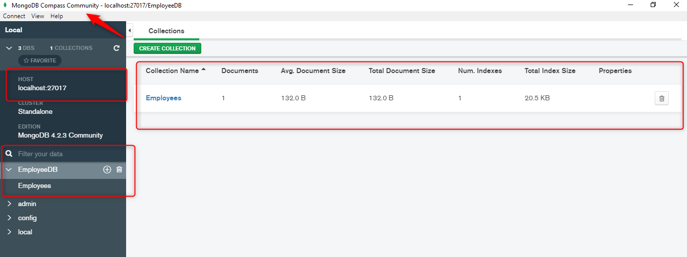

# TutoNetCoreMongoDB
Ejemplo de un proyecto generado en Net Core 3.1 conectando a MongoDB.

### Pre-requisitos 📋

* Visual studio 2019 / Visual Studio Code
* Microsoft .NET Core 3.1
* MongoDB
* MongoDB Compass Community (Opcional)

### Imagenes

MongoDB

NetCore

## Autor ✒️
ISC.Magdiel Efrain Palacios Rivera.
